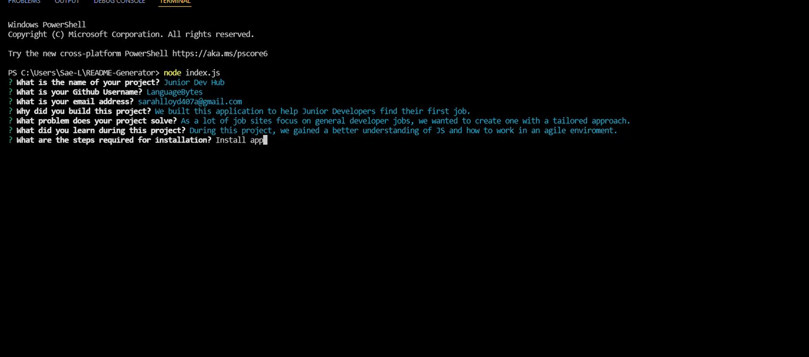

# <p align ="center"> README Generator </p>

 <p align="center">
  
</p>

Link to full demo video on Screencastify - https://watch.screencastify.com/v/aYdpJawUsajLR7oCa6op

OR click to download MP4 video

https://github.com/LanguageBytes/README-Generator/blob/a47086a5a4060ef7a09052deaca92629a2f0a3e9/Demo%20video.mp4
(File is large, please view raw)

  
  ## Description 

This application allows the user to generate a README based on a set of questions created through inquirer. The user will be prompted to answer a series of questions about their project and these answers will determine the structure of the README. The application can be initiated through Node, the user should enter node index.js to initiate the prompts.

  ## Installation 
  
  ```
   npm i 
   
  ```
  Install packages
  
   ## Usage
   
 ```
 node index.js

 ```
 Answer the questions as prompted.
